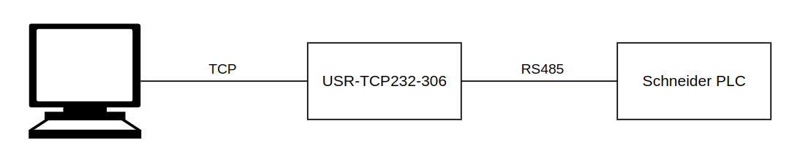

.. pyunitelway documentation master file, created by
   sphinx-quickstart on Wed Aug  3 14:59:05 2022.
   You can adapt this file completely to your liking, but it should at least
   contain the root `toctree` directive.

Welcome to pyunitelway's documentation!
=======================================

Pyunitelway is a Python library to use the UNI-TELWAY protocol to talk to Schneider PLCs (Programmable Logic Controller).

This library allows to:

* Read a bit in ``%S`` and ``%M``
* Read a word in ``%SW``, ``%KW`` and ``%MW``
* Read a double word in ``%KD`` and ``%MD``
* Read multiple bits in ``%S`` and ``%M``
* Read multiple words in ``%SW``, ``%KW``, and ``%MW``
* Read multiple double words in ``%KD`` and ``%MD``
* Write a bit in ``%S`` and ``%M``
* Write a word in ``%SW`` and ``%MW``
* Write a double word in ``%MD``
* Write multiple words in ``%SW`` and ``%MW``
* Write multiple double words in ``%MD``
* Read and write I/O channels (**couldn't test**)

.. toctree::
   :maxdepth: 2
   :caption: Contents:

   ./configuration.rst
   ./client.rst
   ./utils.rst
   ./conversion.rst

How to use ?
============

This library is designed to use a TCP-RS485 adapter. The adapter is connected to the PC or server which uses this lib via Ethernet or Wi-fi or anything else, and is connected to the PLC via RS-485 on the TER plug.

This library was developed using the USR-TCP232-306 adapter. It was not tested with another kind of connection.

   Tested setup

   See :doc:`Configuration </configuration>` for more details

Indices and tables
==================

* :ref:`genindex`
* :ref:`modindex`
* :ref:`search`
